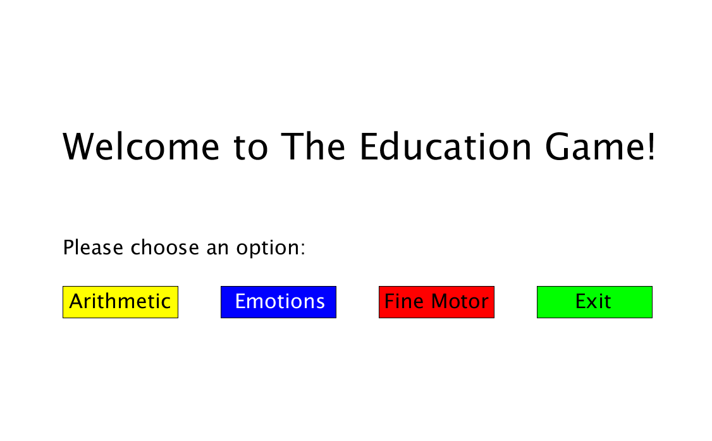

# the-education-game
This project is an educational game for children with autism, intended to improve their development in 3 skill areas: arithmetic, emotion recognition, and fine motor skills. It uses Arduino and Processing for more tactile interactivity, prompting users to push buttons and turn knobs to answer questions displayed on the screen. It was originally started as a class project, and was further developed after the semester finished.

## How it Works

### Main Menu

Upon launch, the user is presented with a main menu screen. Each button on the screen corresponds to a physical button of the same colour. We return to the main menu when a section concludes.

### Arithmetic Section

In the arithmetic section, the user can input their answer through the keyboard, using the backspace button to change their answer, and the enter button to submit.
After an answer has been submitted, a screen pops up to tell the user if they got the answer right (green) or wrong (red). At the end of each section, a results screen displays the total score. The screen is green if a passing mark was achieved, and red otherwise.

### Emotion Recognition Section

In the emotion recognition section, a randomized cartoon facial expression is drawn on screen. You can answer by pressing the corresponding physical buttons.

### Fine Motor Section, Part 1

In the first part of the fine motor section, the user is prompted to turn a knob, in order to match the blue bar to the yellow bar, whihc takes on a random height. After 3 successful attempts, we move on to part 2.

### Fine Motor Section, Part 2

In part 2, the user is prompted to place their finger on a light sensor, for a randomized amount of seconds. The timer resets every time the finger is removed. The section concludes after 3 successful attempts. 

## Circuit Diagram and Hardware

